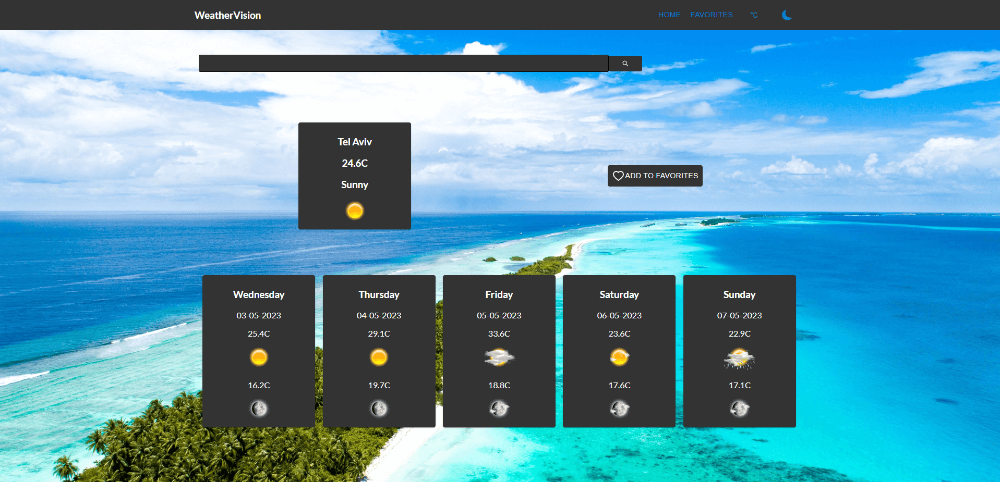

<h1>Weather App</h1>

This is a simple web app built with React and MUI that displays the weather of a city using the AccuWeather API. Users can search for a city, add it to their favorites and view the weather details of the city on the main page. The app has two pages: weather page and favorites page.

<h2>Demo</h2>

You can find a live demo of the app here: https://weather-app-miri.netlify.app/ 

<h2>Specs</h2>
<ul>
  <li>The header includes navigation icons/links/buttons for the main and favorites screen.</li>
  <li>The main screen (weather details) includes a search field to search a location’s weather by city name. The search is triggered when the user presses the "Enter" key. Below the search field, the current weather and a 5-day forecast of the searched location are displayed. A location has an indication if it’s already saved in favorites, and a button to add/remove from favorites is displayed.</li>
  <li>The default location is Tel Aviv weather.</li>
  <li>The favorites screen displays a list of favorite locations. Each location includes an ID, name and current weather. Clicking on a favorite navigates to the main screen showing the details of that location.</li>
  <li>Searching is done in English letters only.</li>
  <li>The state is managed using Zustand.</li>
  <li>The design is responsive using MUI (with flexbox/grid).</li>
  <li>Errors are handled using Toastify. When an error occurs, a toast notification is displayed at the top of the screen for a few seconds.</li>
</ul>
<h2>Libraries/Frameworks Used</h2>
<ul>
  <li>MUI - UI Library</li>
  <li>React - Front-end framework</li>
  <li>Zustand - State management</li>
  <li>Toastify - Error handling</li>
  <li>Dayjs - For date handling</li>
  <li>React-icons - For displaying icons</li>
</ul>

Note: The AccuWeather API used in this app is limited for 50 calls a day. If there is a network problem, you can run the app locally with your own API key.

